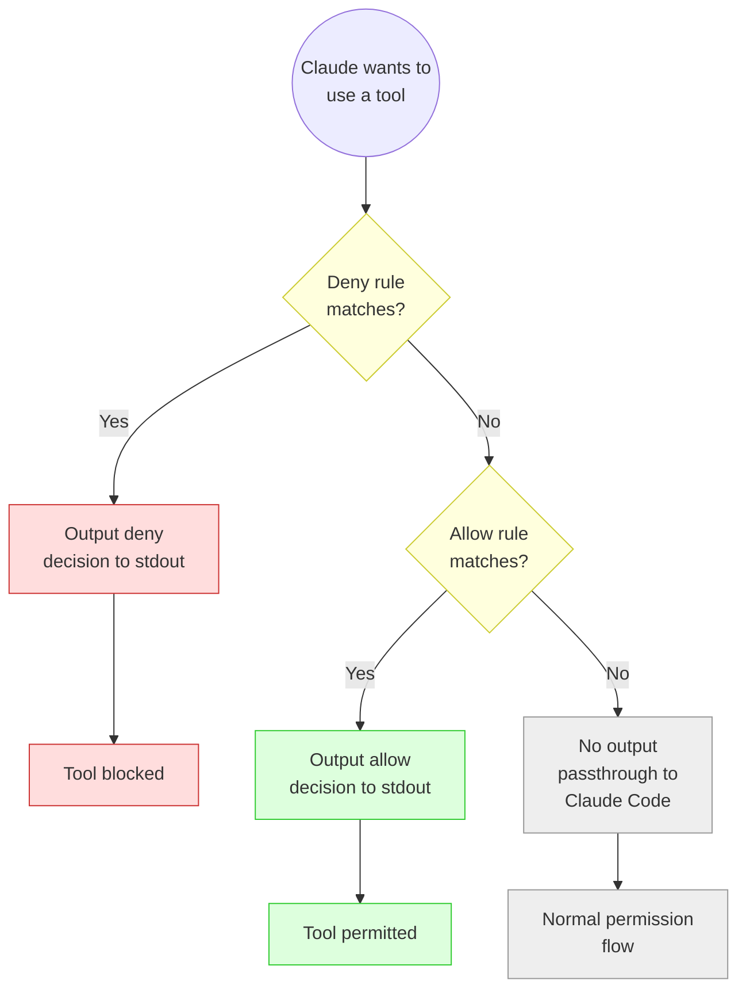

# Claude Guard

A PreToolUse security hook for [Claude Code](https://claude.ai/claude-code) that controls Write, Edit, and Bash permissions via allowlists.

## What it does

Claude Guard is a single bash script that acts as a gatekeeper for Claude Code tool calls:

- **Edit/Write** - Only allowed in explicitly configured directories
- **Bash** - Dangerous commands (rm, install, powershell, ...) are blocked, safe read commands (ls, cat, grep, git log, ...) are auto-allowed, everything else requires user confirmation
- **Shell injection protection** - Detects command chaining (`;`, `&&`, `||`), redirects (`>`), command substitution (`` ` ``), and pipes to interpreters

## How it works



## Installation

```bash
git clone https://github.com/Did-hub/claude-guard.git
cd claude-guard
bash install.sh
```

The installer will:
1. Copy `pretooluse-guard.sh` to `~/.claude/hooks/`
2. Create `guard.conf` from the example (if it doesn't exist)
3. Install `settings.json` (if it doesn't exist) or show merge instructions

## Configuration

All user configuration is in `~/.claude/hooks/guard.conf`. This file is **never overwritten** by `install.sh`, so your settings are preserved when you update.

### Allowed write directories

```bash
# Add directories where Claude may create/edit files
WRITE_ALLOW=$HOME/projects
WRITE_ALLOW=$HOME/.claude
WRITE_ALLOW=/shared/team-folder
```

### Custom Bash rules

```bash
# Additional blocked commands (checked before allow rules)
BASH_DENY=^\s*docker\s+(rm|rmi|prune|system\s+prune)
BASH_DENY=^\s*sudo

# Additional allowed commands (checked after deny rules)
BASH_ALLOW=^\s*docker\s+(ps|images|logs|inspect)
BASH_ALLOW=^\s*composer\s+(show|info|outdated)
BASH_ALLOW=^\s*php\s+artisan\s+(route:list|config:show)
```

### Logging

All decisions are logged to `~/.claude/hooks/guard.log`:

```
[2026-03-16 14:16:10] allow | Bash   | Allowed by allow rule
[2026-03-16 14:16:16] deny  | Bash   | Blocked by deny rule
[2026-03-16 14:23:01] deny  | Write  | Write not allowed outside allowlist
```

Disable logging in `guard.conf`:

```bash
LOG_ENABLED=false
```

### settings.json

The hook is configured in `~/.claude/settings.json`:

```json
{
  "permissions": {
    "allow": ["Read", "Glob", "Grep", "WebSearch", "WebFetch"],
    "deny": []
  },
  "hooks": {
    "PreToolUse": [{
      "matcher": "Bash|Edit|Write",
      "hooks": [{
        "type": "command",
        "command": "~/.claude/hooks/pretooluse-guard.sh"
      }]
    }]
  }
}
```

## Built-in rules

All rules are defined in `guard.conf` and can be commented out or extended.

### Blocked (DENY)

| Category | Examples |
|---|---|
| Destructive | `rm`, `rmdir`, `del`, `format` |
| Installations | `pip install`, `npm install`, `winget install` |
| System commands | `powershell`, `cmd`, `reg`, `net`, `runas` |
| Code execution | `python -c`, `node -e`, `eval` |
| File operations | `mv`, `cp`, `mkdir`, `touch`, `chmod` |
| Process management | `kill`, `systemctl`, `service` |
| Downloads | `curl`, `wget` |
| Shell injection | `;`, `&&`, `\|\|`, `>`, `` ` ``, `$()` |

### Allowed (ALLOW)

| Category | Examples |
|---|---|
| Directory listing | `ls`, `find`, `tree`, `stat`, `du` |
| File reading | `cat`, `head`, `tail`, `wc`, `diff` |
| Text search | `grep`, `rg`, `awk` |
| Git (read-only) | `git log`, `git status`, `git diff`, `git branch` |
| System info | `which`, `whoami`, `uname`, `pwd`, `date` |

Everything not listed above will trigger the normal Claude Code permission prompt (ASK).

## Updating

```bash
cd claude-guard
git pull
bash install.sh
```

The hook script is updated, but your `guard.conf` is preserved.

## Known limitations

- `echo` commands may bypass the hook due to Claude Code's internal handling
- JSON parsing uses grep/sed (not jq) - may break with multiline command strings
- Shell injection detection is pattern-based, not a full parser
- Array-based for-loops in hooks cause Claude Code to ignore deny decisions; this is why rules are combined into a single regex pattern via `paste -sd'|'`

## License

MIT
